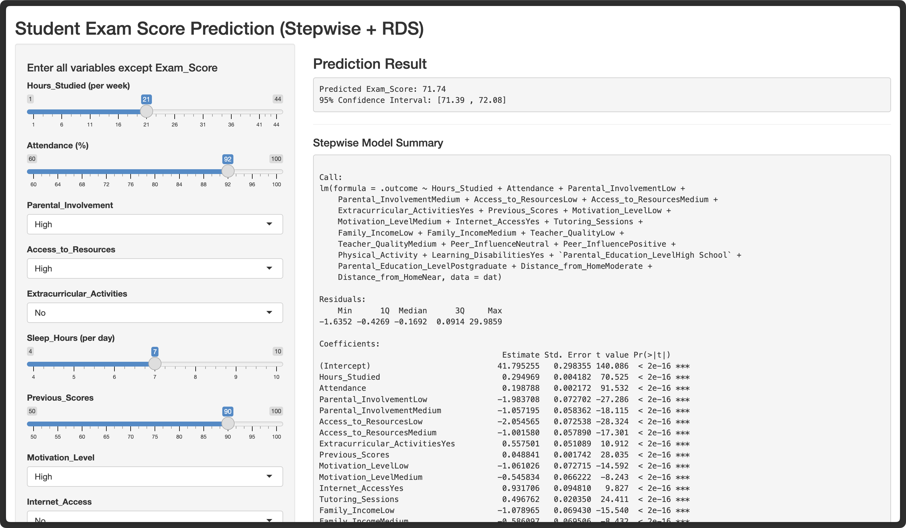

```{r setup, include=FALSE}
knitr::opts_chunk$set(echo = FALSE, warning = FALSE, message = FALSE, 
                      fig.width = 6, fig.height = 4, fig.align = 'center')
library(tidyverse)
library(caret)
library(knitr)
library(gridExtra)
```

# Abstract

In this project, we use a dataset that includes multiple factors influencing students’ academic performance and explore the predictive performance of several variable selection models. Then we choose the model with best performance and develop a shiny website that allow users to do predictions of samples of interest.

# Introduction

In common sense, students' study habits and academic ability are considered key factors causing differences in students academic performance. However, recent studies suggest that students' academic outcomes are associated with a broader range of factors[4], including family environment[5] and school environment[6]. Those findings move us beyond a single-factor perspective and highlight substantial room for further exploration in predicting students' learning outcomes from a multi-dimensional viewpoint.

Through student performance prediction model, teachers and parents can identify students who are at risk of grade decreasing at an early stage and provide support before an actual drop in performance occurs. In addition, the model can be used to predict the learning outcomes of specific groups of students, enabling teachers to implement more personalized instructional strategies and supporting more informed decisions on resource allocation. More broadly, predictive models allow us to evaluate potential outcomes under different instructional scenarios and to simulate how changes in factors such as family income and teacher quality may affect the academic achievement, thereby providing quantitative evidence to inform educational policy making.

Motivated by those benefits, we aim to train an accurate model for predicting student academic performance and to develop an interface that enables teachers and parents to conveniently use the model for students performance prediction.

# Dataset Description

We use a dataset from Kaggle. This dataset is about student academic performance and factors with potential influence on it.The raw dataset contains 6,607 records in total, and includes a rich set of variables spanning personal, academic and environmental domains. The academic aspect includes Hours Studied per Week(1-44 hours), Attendance(60-100%), Previous Scores(50-100), Tutoring Sessions per Month(0- 8), and Exam Score(55-101). Family and School environment contains Parental Involvement, Access to Resources, Family Income, Teacher Quality, all range from Low to High, Peer Influence(Negative, Neutral, Positive), Parental Education Level(High School/College/Postgraduate), Distance from Home(Near/Moderate/Far), and binary variates Internet Access(Yes/No), School Type(Public/Private). Personal factors measured by Sleep Hours(4-10 hours), Motivation Level (Low/Medium/High), Learning Disabilities(Yes/No) and Gender(Male/Female), further Extracurricular Activities(Yes/No) and Physical Activity hours per week(0-6 hours). The primary outcome variate is Exam Score, other 6 numeric variates and 13 categorical features are treated as predictors. The Exam Score appears approximately normally distributed, centering around 65 and symmetric shape around the center. In the original dataset, correlations among the variables are generally weak, and only a subset of variables show non-zero correlations with the outcome Exam Score, such as learning disability, peer influence, attendance, and hours studied, etc. This observation suggests that variable selection models may be appropriate in this case.

# Methods

## Data Preprocessing

We address 235 missing values (3.6% of data) concentrated in Teacher Quality, Parental Education Level, and Distance from Home through complete case deletion, retaining 6,378 observations (96.4% of original data). To identify extreme outliers, we fit an initial linear model on the complete dataset and calculated standardized residuals. Observations with absolute standardized residuals exceeding 3 standard deviations were classified as outliers. We identified 50 outliers (0.78% of cleaned data), which were removed prior to model training. The final cleaned dataset contains 6,328 observations. We then performed a stratified train–test split (70/30) based on the Exam Score outcome to keep the distribution of scores consistent across the two sets. The final split included 4,430 training samples and 1,898 testing samples.

## Exploratory Data Analysis

We performed comprehensive univariate and bivariate analyses to understand distributions, identify patterns, and examine relationships between predictors and exam scores. The outcome variable, Exam Score, is roughly normally distributed and centers around 67–68 points, with scores ranging from 55 to 101. Among the numeric predictors, Hours Studied, Attendance, and Previous Scores show the strongest positive correlations with exam performance. For categorical variables, we compared average exam scores across different groups. Factors such as parental involvement, access to resources, and motivation level appear to have noticeable differences in mean scores across categories.

## Model Development

We evaluated three regression approaches using 10-fold cross-validation on the training data. First, we applied stepwise regression. Backward elimination for automated feature selection. Starting with all 19 predictors, the algorithm iteratively removes the least significant varibles based on AIC (Akaike Information Criterion). Then, LASSO (Least Absolute Shrinkage and Selection Operator) regression with L1 penalty for simultaneous variable selection and regularization. The optimal parameter $\lambda$ is selected via cross-validation to minimize prediction error. Finally, we used ridge regression with L2 penalty-based regularization for handling multicollinearity. Unlike LASSO, Ridge shrinks coefficients but retains all variables in the model. Model selection is based on cross-validated root mean squared error (CV-RMSE). The model with the lowest CV-RMSE is selected for final evaluation on the held-out test set.

# Results

## Model Comparison

Table 1 summarizes the cross-validation results. Stepwise regression obtained the lowest CV-RMSE (0.315), slightly outperforming LASSO (0.316). Ridge regression performed noticeably worse (0.407). Because stepwise regression also provides a more interpretable coefficient structure, we selected it as the final model.

```{r model-comparison-table}
# Load results
comparison <- data.frame(
  Model = c("Stepwise", "LASSO", "Ridge"),
  CV_RMSE = c(0.315, 0.316, 0.407),
  Variables = c(24, 27, 28)
)

kable(comparison, 
      digits = 3,
      caption = "Model Comparison: 10-Fold Cross-Validation Performance",
      col.names = c("Model", "CV-RMSE", "# Variables"))
```

\vspace{0.3cm}

## Model Coefficients

Table 2 shows the coefficients from the final stepwise regression model fitted on cleaned data after outlier removal. All coefficients are statistically significant at the p \< 0.01 level. Several predictors show strong positive effects on exam performance, including Hours Studied (+0.29), Attendance (+0.20), Positive Peer Influence (+1.04), Internet Access (+0.86), and Tutoring Sessions (+0.50). Students who live closer to school (+0.90) and those who participate in physical activity (+0.18) also tend to score higher. Negative effects include Low Access to Resources (–2.04) and Low Parental Involvement (–2.00), which are the two strongest negative predictors. Lower family income, lower motivation, and learning disabilities are also associated with reduced exam performance.

```{r coefficients-table}
# Create coefficient table (abbreviated for space)
coef_table <- data.frame(
  Predictor = c("Hours Studied", "Attendance", "Previous Scores", 
                "Peer Influence (Positive)", "Internet Access (Yes)",
                "Tutoring Sessions", "Distance (Near)", "Physical Activity",
                "Access to Resources (Low)", "Parental Involvement (Low)",
                "Family Income (Low)", "Motivation (Low)", 
                "Learning Disabilities (Yes)", "Teacher Quality (Low)"),
  Coefficient = c(0.29, 0.20, 0.05, 1.04, 0.86, 0.50, 0.90, 0.18,
                  -2.04, -2.00, -1.17, -1.12, -0.84, -1.05),
  Significance = rep("***", 14)
)

kable(coef_table, 
      digits = 2,
      caption = "Selected Model Coefficients (*** p < 0.001)",
      col.names = c("Predictor", "Coefficient", "Sig."))
```

## Test Set Performance

We evaluated the final stepwise model on the test set (n = 1,898). As shown in Table 3, the model performs extremely well on unseen data.

```{r performance-table}
performance <- data.frame(
  Metric = c("RMSE", "MAE", "R²", "Adjusted R²"),
  Value = c(0.320, 0.272, 0.9908, 0.9906)
)

kable(performance, 
      digits = 4,
      caption = "Test Set Performance (Cleaned Data)",
      col.names = c("Metric", "Value"))
```

The R² of 0.991 indicates that the model explains 99.1% of the variability in exam scores. The RMSE of 0.32 means that predictions are typically within about one-third of a point of the true score. About 95% of the predictions fall within ±1 point of the actual values, suggesting strong generalization.

## Model Diagnostics

Figure 1 shows six diagnostic plots assessing regression assumptions. The predicted vs. actual plot (top-left) shows strong linear agreement with points clustering tightly around the diagonal. The residuals vs. fitted plot (top-middle) exhibits random scatter around zero with no discernible patterns, confirming homoscedasticity. The Normal Q-Q plot (top-right) shows residuals following the theoretical diagonal, indicating normality. Table 4 shows statistical tests confirming that all regression assumptions are satisfied. All three tests confirm model validity that residuals are normally distributed (Shapiro-Wilk p \> 0.05), exhibit constant variance (Breusch-Pagan p \> 0.05), and show no autocorrelation.

```{r diagnostic-tests-table, results='hide'}
# Perform tests
load("../data/processed/test_data_clean.rda")
test_data_clean <- test_clean
final_model_clean <- readRDS("../models/final_model_clean.rds")

source("../R/07_diagnostics.R")
eval_clean <- evaluate_model(final_model_clean, test_data_clean)
tests <- residual_tests(eval_clean)

test_results <- data.frame(
  Assumption = c("Normality", "Homoscedasticity", "Independence"),
  Test = c("Shapiro-Wilk", "Breusch-Pagan", "Durbin-Watson"),
  Result = c("p > 0.05", "p > 0.05", "DW = 2.0")
)

kable(test_results,
      caption = "Diagnostic Test Results",
      col.names = c("Assumption", "Statistical Test", "Result"))
```

## Outlier Analysis

Outlier removal significantly improved model performance. Table 5 compares results before and after outlier treatment. Removing 50 outliers (0.78% of cleaned data) reduced RMSE from 1.745 to 0.320 (81.7% reduction) and increased R² from 0.790 to 0.991 (25.4% improvement). These outliers represented students whose performance deviated substantially from model predictions, likely due to unmeasured factors such as test anxiety, health issues, or data quality concerns.

```{r outlier-comparison-table}
# Load original results for comparison
load("../data/processed/test_data.rda")
final_model_original <- readRDS("../models/final_model.rds")

pred_original <- predict(final_model_original, test_data)
rmse_original <- sqrt(mean((test_data$Exam_Score - pred_original)^2))
r2_original <- cor(test_data$Exam_Score, pred_original)^2

outlier_comp <- data.frame(
  Dataset = c("Original (with outliers)", "Cleaned (outliers removed)"),
  N_Observations = c(nrow(test_data), nrow(test_data_clean)),
  RMSE = c(rmse_original, eval_clean$rmse),
  R2 = c(r2_original, eval_clean$r2)
)

kable(outlier_comp,
      digits = 4,
      caption = "Impact of Outlier Removal on Model Performance",
      col.names = c("Dataset", "N", "RMSE", "R²"))
```

# Application: Interactive Shiny Web Tool

We integrate prediction visualization and statistical inference into one webpage via R Shiny. The webpages contains two panels: User Input and Result Output.

Considering the need to support multi-user access and large-scale database storage, we utilized Amazon Web Services. When building R Shiny, data were retrieved from a cloud database and used to train a predictive model for user using. Users are allowed to input student characteristics, after which the input data are preprocessed to ensure compatibility with the trained model. Once users click Predict button, the model then returns predicted outcomes along with corresponding 95% confidence intervals on the right.

## Conclusion

This study developed a predictive model for student exam performance using 19 predictors including study habits, family background, and school environment. Among the three regression approaches evaluated, stepwise regression achieved the best performance with several key predictors of academic success. Positive factors include hours studied, attendance rate, peer influence, internet access, and proximity to school. Conversely, low access to resources and low parental involvement emerged as the strongest negative predictors. These findings align with educational research emphasizing the importance of both individual effort and environmental support. After removing 50 outliers (0.78% of data), the model achieved excellent predictive accuracy on the test set, with an $R^2$ of 0.991 and RMSE of 0.320.

## Future Directions

In this project, we mainly use classical linear regression models. But we also explore Bayesian linear models, whose performance is not as good as that of classical linear models. For further exploration, we plan to allow users to select appropriate prior information for the model, which may enable Bayesian approaches to achieve improved predictive performance. Since such operations need to be implemented within a Shiny website, improving the convergence speed of Bayesian models is critical. To this end, we consider replacing the MCMC approach by a variational inference framework, which may substantially accelerate computation and help meet the practical requirements of real-time interaction. \newpage

# References

[1]Hastie, T., Tibshirani, R., & Friedman, J. (2009). *The Elements of Statistical Learning: Data Mining, Inference, and Prediction* (2nd ed.). Springer. <https://doi.org/10.1007/978-0-387-84858-7>

[2]Hocking, R. R. (1976). A Biometrics invited paper: The analysis and selection of variables in linear regression. *Biometrics*, 32(1), 1--49. <https://doi.org/10.2307/2529336>

[3]Tibshirani, R. (1996). Regression shrinkage and selection via the lasso. *Journal of the Royal Statistical Society: Series B (Methodological)*, 58(1), 267--288. <https://doi.org/10.1111/j.2517-6161.1996.tb02080.x>

[4]Sirin, S. R. (2005). *Socioeconomic status and academic achievement: A meta-analytic review.* Review of Educational Research, 75(3), 417–453. <https://doi.org/10.3102/00346543075003417>

[5]Hill, N. E., & Tyson, D. F. (2009). *Parental involvement in middle school: A meta-analytic assessment.* Developmental Psychology, 45(3), 740–763. <https://doi.org/10.1037/a0015362>

[6]Hanushek, E. A. (2011). *The economic value of higher teacher quality.* Economics of Education Review, 30(3), 466–479. <https://doi.org/10.1016/j.econedurev.2010.12.006>

# Contributions

He Zhang: Model fitting and diagnose; Data exploring and wrangling 

Guanyi Wu: Database construction and Shiny website; Bayesian model exploration

# Appendix

## Model Diagnosis

```{r diagnostic-plots, fig.width=6, fig.height=4, fig.cap="Model Diagnostic Plots", results='hide'}
# Load evaluation results
load("../data/processed/test_data_clean.rda")
test_data_clean <- test_clean
final_model_clean <- readRDS("../models/final_model_clean.rds")

source("../R/07_diagnostics.R")
eval_clean <- evaluate_model(final_model_clean, test_data_clean)
plot_diagnostics(eval_clean)
```

## Code Availability

All analysis code, including data preprocessing, model training, diagnostics, and Shiny application, is available in the [GitHub repository: https://github.com/hhhhhz123/StudentPerformancePredict](https://github.com/hhhhhz123/StudentPerformancePredict). Interactive Shiny application: <https://biotat625group3.shinyapps.io/shiny/>

## Session Information

```{r session-info, echo=TRUE}
sessionInfo()
```

## Shiny Website


